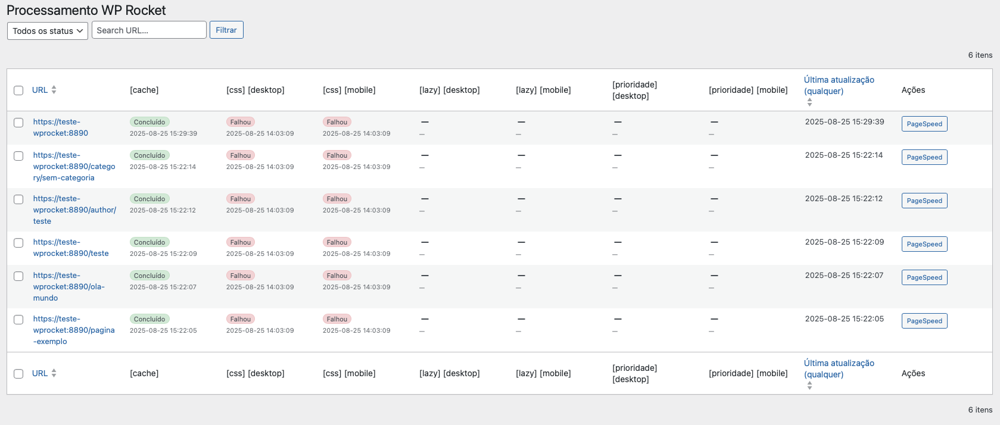

# Processing WP Rocket

  

A diagnostic companion for **WP Rocket** that visualizes processing information from WP Rocket’s internal database tables.

> **Heads‑up:** This is **not** an official WP Rocket plugin. It does not replace or modify WP Rocket behavior; it only **reads and displays** information in the WordPress admin.

---

## ✨ Highlights (v2.0.0)

- **Unified table view** with search and filters  
- **Status badges** (Pending, In Progress, Completed, Failed) with colors  
- **Status + date** in the same cell (date adjusted to your **WordPress timezone**)  
- **Cache status unified** (no desktop/mobile split)  
- **PageSpeed Insights** button for each URL  
- **i18n-ready** (English default) and **pt_BR** translation included

---

## 🔎 What it reads

From WP Rocket tables (auto‑detected):
- `wpr_rocket_cache`
- `wpr_rucss_used_css`
- `wpr_lazy_render_content`
- `wpr_above_the_fold`

The plugin aggregates data **by canonical URL** (scheme + host + path), showing per‑layer status (cache, Used CSS, lazy, priority elements).

---

## ✅ Requirements

- WordPress **6.0+**
- PHP **7.4+**
- **WP Rocket** active (for data to be available)

---

## 📦 Installation

1. Download the plugin ZIP from the releases or build it locally.  
2. In **WordPress Admin → Plugins → Add New → Upload Plugin**, upload the ZIP.  
3. Activate. You’ll see **Processing WP Rocket** in the admin menu.

---

## 🧭 Usage

1. Keep **WP Rocket** active.  
2. Go to **Tools → Processing WP Rocket**.  
3. Browse the table: each cell shows **status** (color) and **last update date** for that layer/device.  
4. Use the **PageSpeed** button to open a quick test for the URL.

> Notes
> - The plugin **does not** clear caches or change WP Rocket settings.  
> - For large sites, use the search/filter UI to reduce result sets.

---

## 🌐 Internationalization

- Default strings in **English**.  
- Included translation: **Português (Brasil)** `pt_BR`.  
- Text domain: `processing-wp-rocket`.  
- WordPress will load the translation automatically according to **Settings → General → Site Language**.

---

## 🧩 Developer Notes

- Admin table built with `WP_List_Table`.  
- Dates rendered with `wp_date()` and `wp_timezone()` to respect the site timezone.  
- Status normalization maps common synonyms to: `pending`, `in_progress`, `completed`, `failed`.

### Filters

- `pwr_status_labels` — customize status labels displayed on badges.  
- `pwr_datetime_format` — change date format (default `Y-m-d H:i:s`).  
- `pwr_tables` — override/extend which WP Rocket tables are scanned.  
- `pwr_min_capability` — adjust capability needed to access the screen (default `manage_options`).

---

## 🖼 Visualization example

> The example above shows the listing with status columns, identification colors and direct links to the URLs.

---

## 🚀 Changelog (excerpt)

### 2.0.0
- Unified **cache** status (no desktop/mobile).  
- Timezone‑aware date rendering.  
- i18n support with **pt_BR** translation.  
- Removed purge/clear buttons; kept only **PageSpeed**.  
- UI cleanup & stability improvements.

### 1.0.0
- Initial release with admin table of WP Rocket processing info.

Full changelog lives in [`readme.txt`](./readme.txt) (WordPress.org format).

---

## 📄 License

GNU General Public License v2.0 or later. See [`LICENSE`](./LICENSE) or the header in the main plugin file.
